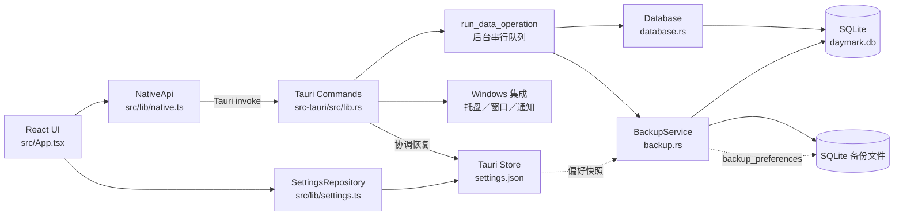
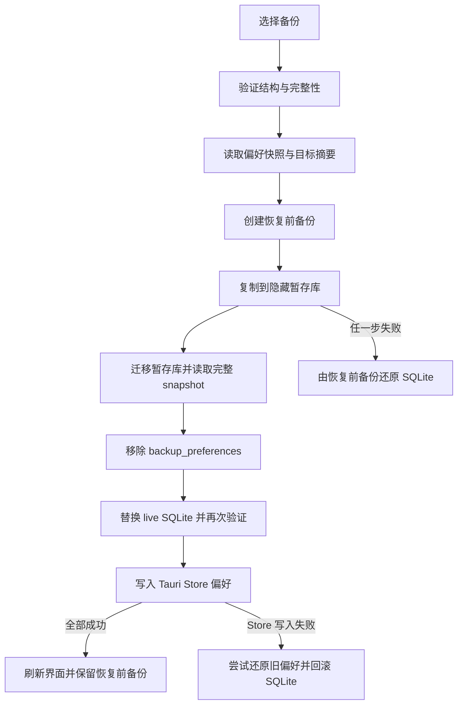

# Daymark 项目实现与 Agent 接手指南

> 当前可交付基线：阶段 2 正式 21 天候选版 + 阶段 3 完整日历体验与项目约束（M1–M6 + M7.1–M7.4）、SQLite schema v7。阶段 3 M1–M6 扩展前端日历、Tauri Store 设置与执行时段批量原子命令；M7 引入项目截止日期、项目里程碑与到期结果快照作为核心领域事实。

## 1. 文档定位

本文是 Daymark **当前真实实现**的中心入口，回答"现在代码是怎么工作的"，并明确区分已交付能力、规格目标和仍未实现的边界。

- 产品目标、领域语言和产品原则以 [`CONTEXT.md`](../CONTEXT.md) 为准。
- 阶段范围和验收标准以 [`docs/specs/`](specs/) 为准。
- 交互与视觉目标以 [`docs/design/UI-SPEC.md`](design/UI-SPEC.md) 为准。
- 已作出的长期架构决策以 [`docs/adr/`](adr/) 为准。
- 本文只描述已经存在的代码、当前边界和可靠的修改入口，不把规划写成已实现能力。
- 本文不复制大段源码；使用相对路径和符号名称指向事实来源。实现与本文冲突时，先以代码和测试为事实，再按下文"文档同步协议"修正文档。

## 2. 当前实现阶段

Daymark 当前可交付能力完成到 **阶段 3 M6：周视图全天区、月视图摘要与键盘导航**；阶段 2 的 21 天真实使用验证仍按固定方案并行进行。

已经实现：

- Tauri 2、React、TypeScript、Vite 和 Tailwind CSS 组成的 Windows 桌面工程，可生成 NSIS 安装包。
- SQLite 核心数据库、显式 `schema_version`、七步事务迁移，以及阶段 1 事实、阶段 2 习惯／挽救状态对象与阶段 3 M7 项目约束／结果快照对象。
- 启动每日备份、用户强制刷新当日备份、手动备份、备份预览、安全恢复和失败回滚。
- Tauri Store 设置持久化，以及设置偏好随 SQLite 备份迁移和协调恢复。
- 今日、日历、项目、7 天回顾、数据与设置六个页面；活动任务池在行动页面常驻或按窗口宽度显示为覆盖面板。
- 仅标题快速创建、任务渐进编辑、手动完成度、截止提示和全部／未安排／已安排筛选。
- 任务池在活动任务列表上方提供可折叠的"需要关注"区，收纳已逾期及未来 7 天内截止的任务，且这些任务不在下方普通任务区重复出现。
- 普通项目、文本课程解析预览和项目＋任务单事务写入。
- 日／周／月三视图；日视图以前一天／锚点日／后一天三段缓冲连续跨日，周视图周一开头且日期头可进入对应日视图，月视图固定六行并保留弱化的相邻月份日期。各视图独立持久化日期锚点、三档缩放入口与实际连续比例；日／周时间轴支持普通滚轮浏览和以指针时间为锚点的 `Ctrl + 滚轮`／触控板捏合缩放。执行卡片按可用高度分为紧凑、标准、详细三层信息量，缩放不写入或改变排程事实。现有吸附、默认时段、拖入、移动／缩放时长、精确编辑、拖回取消和撤销保持不变。
- 日视图可持久化选择“默认时段”或“全天”。默认时段模式把非默认区域压缩为固定高度、带范围与安排数量的折叠条；点击可临时展开，拖拽悬停约 500ms 后展开、拖离恢复、成功投放后保留。今天会自动显露当前时间前后各约一小时，今日页跳转会显露并高亮目标时段；所有临时展开只存在于当前 React 浏览状态，连续缩放仍锚定指针所指时间。
- 日／周拖拽持续显示精确起止时间与落点；工具栏磁铁按钮显示当前吸附状态，`Alt` 临时反转吸附。已有卡片边缘显示插入线和“插入并后移”预览，中央悬停约 500ms 切换为“同时安排”；拖离只清除内存预览，松手后才通过 `applyExecutionSessionChanges` 单事务提交，并以一个撤销项整体恢复。并行 2–3 项等宽并排，4 项以上保留前 2 项和“另外 N 项”入口。空白悬停显示 `＋` 与时间，单击或纵向框选打开预填范围的三入口气泡。
- 周视图顶部提供可折叠的全天标记区，承载任务截止旗帜、项目截止旗帜与里程碑菱形，单日超过两项时通过“另外 N 项”原位展开，点击标记在右侧打开对应任务或项目详情；月视图日期格按任务截止、项目截止／里程碑、完成、推进与未推进摘要展示最多三行，选中日期后在右侧显示完整列表。周／月视图支持方向键、`Page Up`／`Page Down`、`Home`／`End` 与 `Enter` 的对应导航和打开语义，焦点与选中状态相互独立。
- 今天的日／周时间轴显示当前时间线和已过去区域；当前安排同时使用边框、光晕、文字和图标标记，并以细时段进度条与较粗手动任务进度条区分两种事实。滚离当前时间后提供带方向提示的“回到现在”。
- 已结束、未完成且尚无已结束执行记录的时段显示“待回顾”，可更新进度、确认后续安排或由用户明确记录“本次未推进”；时间经过本身不再自动写入 `missed`／未执行事实。
- 日历工具栏可持久化开启“显示实际记录”：计划时段退为淡色虚线，实际记录按真实开始／结束或当前时间叠加为实色层；提前、延后和重叠只读呈现，不反向移动计划。设置页可隐藏这一工具栏入口，而不删除事实或改变已保存的叠加状态。
- 可选开始签到、结束本次、实际投入修正、短评与进度原子提交；挽救提示事实仍单独持久化，任务完成度始终由用户确认。
- 自动排程 Lite 在未来 7 天默认时段的空档中生成确定性草案，避开已有安排与时间块；用户选择、预览、确认后才原子写入，并可整批撤销。
- 日历可创建／删除轻量时间块；重复习惯支持每天、工作日、每周选日、单次时长与可选固定开始，并以独立发生项进入执行闭环。
- 今日页在签到与挽救提示开启时提供一次持久化的中性恢复入口；7 天回顾汇总实际投入、进度、待续与跳过事实，不评分。
- B 站链接导入 Beta 通过原生层读取普通公开视频／分 P 公开元数据，先提供可编辑、可取消选择的预览，再以单事务写入项目和有序任务。
- 执行提醒、启动摘要、关闭窗口驻留托盘、托盘左键／菜单恢复和显式退出；提醒成功后 30 分钟内首次托盘恢复会定位对应日历时段，其他情况进入今日页。
- 暖杏浅色／深色／跟随系统主题、减少动态偏好（设置页可选跟随系统／减少／完整）、100%–200% 缩放和基础键盘／辅助技术支持。
- 设置页可编辑零个或多个默认时段（名称、起止时间、适用星期）并新增或删除时段，也可设置日视图默认显示模式；数据页持续显示自动备份失败并可在成功后清除。

当前已知边界：

- 阶段规格中的开机自启尚未实现；仓库没有 autostart 插件或设置项。
- 提醒由运行中的前端每 30 秒检查今日计划并调用桌面通知；应用必须仍在托盘进程中。Windows 通知插件本身没有任务级点击回调；原生 `AppState` 会暂存最近成功提醒的时段及发送时刻，30 分钟内首次托盘恢复直接进入对应日历日期、临时显露并高亮该时段，随后消费该目标。其他原生入口可发送 `daymark-open-session` 事件复用同一路由；目标不存在时回退今日页。
- 连续日视图当前使用三日缓冲和边界平移，不做无限日期 DOM；日／周时间轴的连续比例限制在每小时 28–96px，月视图继续使用紧凑／标准／详细三档行高。
- 阶段 3 M1–M6 已完成，M7 四段（M7.1 核心数据 / M7.2 项目编辑 / M7.3 日历标记 / M7.4 历史与风险）亦已全部完成。M7 以项目截止日期、项目里程碑与到期结果快照为第一等核心事实（schema v6→v7）；日历复用 M6 标记接缝呈现项目截止旗帜与里程碑菱形。Windows 通知插件仍不提供任务级点击回调，M4 通过提醒后的托盘恢复、应用内今日页入口和 `daymark-open-session` 事件完成目标路由。独立截止任务页、完整日／周／月回顾、复杂重复规则、AI 规划和高级布局自定义仍属后续阶段。
- 阶段 3 已完成正式验收，详见 [`docs/reports/phase-3-acceptance.md`](reports/phase-3-acceptance.md)：规格 0003 的 M1–M6 与规格 0004 的 M7.1–M7.4 全部验收标准满足，Vitest 106 / Rust 33 / Playwright 15 全通过。
- 自动排程的"单次投入时长"是优先尝试的目标长度而非不可拆分的硬约束；所有任务都可被部分安排，部分安排只生成一个执行时段、不自动补排剩余时长（2026-08-10 对规格 0002 AC4 的澄清，与 CONTEXT.md 领域语言一致）。
- 阶段 2 已完成正式验收，详见 [`docs/reports/phase-2-acceptance.md`](reports/phase-2-acceptance.md)：规格 0002 的 24 条验收标准全部满足，Vitest 55 / Rust 24 / Playwright 9 全通过；后续真实使用验证按 [`docs/reports/phase-2-21-day-validation-plan.md`](reports/phase-2-21-day-validation-plan.md) 执行。

[`prototype/daymark-core/`](../prototype/daymark-core/) 是内存原型，不连接生产 SQLite、Tauri Command 或备份协议，不能据此判断生产功能已经完成。

## 3. 总体架构



浏览器开发／E2E 环境没有 Tauri IPC 时，`createNativeApi()` 使用 `BrowserPreviewApi`，设置使用 `localStorage`。这只是前端预览接缝，不是独立网页版产品。

## 4. 运行时数据流

### 启动与初始化

1. [`src-tauri/src/main.rs`](../src-tauri/src/main.rs) 调用 `daymark_lib::run()`。
2. `run()` 注册 Store 与文件对话框插件，在应用数据目录建立 `daymark.db`、`backups/` 和 `settings.json` 的路径。
3. `Database::open()` 打开 SQLite、启用外键和 WAL，并通过 `migrate()` 按版本执行迁移。
4. `BackupService::create_daily()` 尝试创建当天备份；已有同日备份时只验证和去重。失败原因保存在 `AppState.backup_error`，不会阻止应用启动。
5. React 启动后，`App` 并行调用 `SettingsRepository.load()` 和 `NativeApi.getWorkspace()`；完成后恢复最后页面、工作区和显示偏好。
6. 前端在开始签到与挽救提示开启时检查超过宽限期、尚无实际记录的时段，并先持久化一次提示事实；时段结束只在界面进入“待回顾”，不会因时间经过自动写成未执行。

### 前端与原生层

- [`src/lib/native.ts`](../src/lib/native.ts) 是前端唯一的原生接口边界。
- `TauriNativeApi` 将工作区读写、通知、数据概览、每日／手动备份、备份检查和恢复映射到 `invoke`。
- [`src-tauri/src/lib.rs`](../src-tauri/src/lib.rs) 的 Command 不直接在事件线程执行磁盘工作；`run_data_operation()` 使用 `spawn_blocking`，再以 `data_operation_lock` 串行化数据库和备份操作。
- Rust 错误转换为可读字符串返回前端；`App` 根据影响范围显示加载横幅、自动备份持续警示、操作错误或恢复模态内错误。
- `mutate_workspace()` 在每次核心写操作后读取新快照并刷新当天备份；备份失败被记录为持续状态，但不把已成功的核心写入伪装成失败。

### 数据概览

`get_data_overview` 打开数据库并调用 `Database::snapshot()`，返回 schema 版本、数据／备份目录、六类对象数量、备份列表和当前启动周期内的自动备份错误。

### 托盘、关闭与提醒

- Tauri 启动时创建带"显示 Daymark／退出"菜单的托盘图标；左键托盘或选择"显示"会显示、取消最小化并聚焦主窗口。若存在 30 分钟内尚未消费的提醒目标则发送 `daymark-open-session`，否则发送 `daymark-open-today`。
- 主窗口收到 `CloseRequested` 时阻止进程退出并隐藏窗口；只有托盘"退出"会调用 `app.exit(0)`。
- 前端在执行提醒开启时每 30 秒检查今日 `scheduled` 时段，在提前量窗口内连同时段 ID 调用 `show_reminder`；同一前端运行周期用内存集合避免同一时段重复提醒。原生通知成功后才记录托盘恢复目标。
- 启动摘要支持每次启动、每天首次启动或从不提醒；没有任务时不发送。每天首次提醒日期写入设置。
- 当前没有开机自启、Windows 通知卡片自身的点击回调或系统权限状态页；任务级恢复通过通知文案指引的托盘入口实现，文档和 UI 不能把通知卡片点击写成已实现。

### 设置加载与排序保存

- `SettingsRepository.load()` 读取并规范化显示、页面、日历视图／日视图模式／锚点／缩放、实际记录叠加、提醒和默认时段偏好。
- `SettingsRepository.save()` 通过 `writeQueue` 串行化快速连续写入，防止较慢的旧写入覆盖较新的选择。
- `App.persist()` 使用 revision 只让最新请求更新"已保存／未保存"状态；失败时界面保留用户选择并提供重试。
- 恢复完成后，原生层已经写入 Tauri Store；`SettingsRepository.normalize()` 只负责让 React 立即采用恢复后的偏好。

### 自动备份与恢复队列

- 启动自动备份调用 `create_daily()`，同一天只保留一个滚动副本。
- 用户点击"立即创建每日备份"调用 `refresh_daily()`，必须重新捕获当前数据库，不能把已存在文件误报为新备份。
- 所有手动备份、检查和恢复都进入同一个后台串行队列，避免相互覆盖或阻塞 Tauri 事件线程。
- 恢复的详细安全协议见"备份与恢复协议"。

## 5. 代码地图

| 路径 | 当前职责 |
| --- | --- |
| [`src/App.tsx`](../src/App.tsx) | 六页应用壳、今日／任务池／项目／7 天回顾流程、阶段 2 行动辅助，以及阶段 3 M1–M6 的三视图、连续日轴、状态与实际叠加、缩放、自适应、折叠、完整拖拽、全天截止标记、月摘要和键盘导航；M7 的项目截止编辑、里程碑 CRUD、续排入口与到期结果展示也在项目页与日历标记中实现；同时负责进度与执行闭环、提醒、设置保存、备份错误与恢复模态。 |
| [`src/lib/calendarPlacement.ts`](../src/lib/calendarPlacement.ts) | M5 插入后移计算与并行卡片分栏／4 项以上汇总布局的纯逻辑接缝。 |
| [`src/lib/calendarTimeline.ts`](../src/lib/calendarTimeline.ts) | 日视图默认时段合并、非默认区间补集、当前窗口与临时展开合成，以及折叠时间轴的分钟／像素双向映射；只负责前端布局，不创建领域事实。 |
| [`src/lib/calendarSummary.ts`](../src/lib/calendarSummary.ts) | M6 任务截止紧迫度、单日截止／完成／推进／未推进摘要及月格三行截断，以及 M7.3 项目截止／里程碑日历标记聚合（`calendarDayMarkers`）的纯读取接缝；只读投影，不创建领域事实。 |
| [`src/lib/native.ts`](../src/lib/native.ts) | `NativeApi` 类型边界、Tauri IPC 适配、文件对话框和浏览器 `localStorage` 预览实现。 |
| [`src/lib/settings.ts`](../src/lib/settings.ts) | 显示、页面、日历、提醒、启动摘要和默认时段设置的默认值、规范化与顺序写入；Tauri Store 与浏览器后端。 |
| [`src/lib/courseImport.ts`](../src/lib/courseImport.ts) | 把常见分集文本与末尾时长解析为可编辑、可取消选择的有序任务草稿。 |
| [`src/styles.css`](../src/styles.css) | 扁平暖杏语义变量、浅／深色令牌、两／三栏布局、窄窗覆盖任务池、纵向日历、焦点、缩放重排和减少动态规则。 |
| [`src/components/ui/button.tsx`](../src/components/ui/button.tsx) | 当前唯一共享 UI 组件；通过 CVA 提供按钮变体、尺寸和转发 ref。 |
| [`src/App.test.tsx`](../src/App.test.tsx) | 今日壳、任务池、纵向时间轴、阶段 2 行动闭环，以及阶段 3 三视图／锚点、跨日边界、当前安排双进度、待回顾三操作、计划／实际叠加、折叠计数／临时展开、全天截止溢出、周／月键盘导航、选中态、跨页目标显露和外部 session 事件路由测试。 |
| [`src/lib/calendarSummary.test.ts`](../src/lib/calendarSummary.test.ts) | 单日摘要优先级、三行截断、进度合计、未推进事实与任务截止紧迫度边界测试。 |
| [`src/lib/calendarTimeline.test.ts`](../src/lib/calendarTimeline.test.ts) | 重叠与跨午夜默认时段合并、跨午夜时段的星期归属、无默认时段的当前两小时窗口，以及折叠时间轴分钟／像素可逆映射测试。 |
| [`src/lib/courseImport.test.ts`](../src/lib/courseImport.test.ts) | 分集标题、时长、空行与重复标题解析测试。 |
| [`src/lib/settings.test.ts`](../src/lib/settings.test.ts) | 设置重启恢复、无效值回退、写入排序、恢复值规范化、吸附关闭、零个／多个默认时段，以及阶段 3 日历锚点／日视图模式／三档与连续比例／实际记录开关规范化测试。 |
| [`src-tauri/src/lib.rs`](../src-tauri/src/lib.rs) | Tauri 组装、托盘与关闭行为、桌面通知及 30 分钟内的提醒目标恢复事件、`AppState`、Command、后台串行执行、写后备份及 SQLite／Store 协调恢复。 |
| [`src-tauri/src/database.rs`](../src-tauri/src/database.rs) | SQLite v5 连接、迁移、工作区查询、任务／项目／排程／执行／进度／习惯／时间块／挽救事实事务写入和时间校验。 |
| [`src/lib/scheduling.ts`](../src/lib/scheduling.ts) | 自动排程 Lite 的确定性候选排序、空档扣除、最小时长与固定习惯时间计算。 |
| [`src/lib/recurrence.ts`](../src/lib/recurrence.ts) | 基础重复规则的本地日期发生项计算。 |
| [`src/lib/review.ts`](../src/lib/review.ts) | 最近 7 个本地日期的事实汇总，不生成评分或连续天数。 |
| [`src/lib/bilibili.ts`](../src/lib/bilibili.ts) | 从普通 B 站链接或文本中提取并规范化 BV 号。 |
| [`src-tauri/src/backup.rs`](../src-tauri/src/backup.rs) | SQLite Online Backup、滚动保留、偏好嵌入、检查、预览、Windows 原子替换、恢复和回滚。 |
| [`src-tauri/src/models.rs`](../src-tauri/src/models.rs) | 八类 Rust 核心数据结构和 camelCase 序列化边界。 |
| [`src-tauri/migrations/`](../src-tauri/migrations/) | v1–v5 的 SQLite schema 历史，由 `database::migrate()` 按序内嵌并执行。 |
| [`e2e/phase1.spec.ts`](../e2e/phase1.spec.ts) | 快速创建持久化、拖拽与撤销、时段移动／取消、课程导入、执行结束、浅／深色 axe、200% 缩放、窄窗布局、日历状态恢复，以及 M2 计划／实际叠加、M3 指针锚点缩放、M4 折叠边界、M5 插入预览／原子提交与空白框选、M6 月摘要／全天溢出／吸顶与键盘导航测试。 |
| [`scripts/run-e2e.mjs`](../scripts/run-e2e.mjs) | 在 Windows 上启动 Vite、等待 1420 端口、运行 Playwright 并回收开发服务器。 |
| [`package.json`](../package.json) | 前端开发、测试、E2E、构建、原生测试和 Tauri CLI 命令。 |
| [`src-tauri/Cargo.toml`](../src-tauri/Cargo.toml) | Rust/Tauri、bundled SQLite、Store、文件对话框和 Windows 原子替换依赖。 |
| [`src-tauri/tauri.conf.json`](../src-tauri/tauri.conf.json) | Daymark 窗口、最小尺寸、CSP、前端构建和 NSIS 打包配置。 |

## 6. 核心领域模型

| 对象 | 职责与关系 |
| --- | --- |
| `Project` | 长期结果；通过 `Task.project_id` 聚合任务，本身不占用日历；持有可空的项目截止日期（`deadlineLocal`），与子任务截止独立。 |
| `ProjectMilestone` | 项目内的阶段检查点；持有标题、目标本地日期、稳定排序值和且仅一种达成条件（指定任务完成／完成任务数量／项目加权进度）。 |
| `MilestoneOutcome` | 里程碑到期且未达成时冻结的一次性结果快照；保留原标题、目标日期、达成与否与中文结果文本，后续进度变化不改写历史。 |
| `Task` | 可逐步完成的工作；可独立或属于项目，持有当前手动完成度、`status`、可空截止日期、预计／单次投入时长、优先级、排序值，以及可选来源链接／键／媒体时长；`kind=habit` 的内部任务不进入普通任务池。 |
| `ExecutionSession` | 关联任务的计划执行时段；保存开始／结束本地日期与时间、时区标识字符串、UTC 偏移和状态。 |
| `ExecutionRecord` | 用户确认的一次实际执行；可关联计划时段，也直接关联任务，保存 UTC 时间点和备注。 |
| `ProgressEvent` | 一次独立的手动进度变化，记录 `from_progress`、`to_progress` 和 UTC 发生时间。 |
| `TimeBlock` | 不关联任务的占用时间，如会议、通勤或休息；没有完成度。 |
| `RecurringHabit` | 持续的基础重复定义；保存每天／工作日／每周选日规则、开始日期、单次投入时长和可选固定开始时间，并关联一个内部执行任务。 |
| `HabitOccurrence` | 某个习惯在一个本地日期的独立显式状态；可为已安排、已完成或已跳过，并可关联执行时段。 |
| `rescue_prompts` 事实 | 以执行时段为键持久化挽救提示已显示时间；工作区只暴露已提示的时段 ID，避免同一时段重复催促。 |

必须保持的领域不变量：

- 计划时间、实际执行记录和进度事件必须分离。
- 投入时间和执行记录不能自动改变任务完成度；`Database::apply_progress()` 才写入进度事件并以事务更新任务。
- 本地日期、本地时间、时区标识字符串、UTC 偏移和 RFC 3339 UTC 时间点不可混用；当前实现只校验时区标识非空，尚未验证其是否为合法 IANA 时区。
- 旧数据中未知的 `ExecutionSession.utc_offset_minutes` 保留为 `None`，不能伪造为 `0`。
- `Database::create_session()` 要求新时段提供 -14:00 至 +14:00 范围内的有效 UTC 偏移。
- 跨午夜时必须分别保存 `local_date` 与 `end_local_date`，不能通过比较时钟字符串改写日期事实。
- `Database::create_execution_record()` 要求实际时间为 RFC 3339，偏移必须是 `Z`／`+00:00`，结束必须晚于开始。
- 项目与其任务批量保存、进度事件与任务进度更新必须保持事务原子性。
- 自动排程草案中的全部执行时段与习惯发生项必须在一个事务中写入或全部回滚；草案本身不持久化。
- 重复习惯定义与内部任务、习惯发生项与其执行时段必须成对原子写入；跳过习惯时段要同步发生项，但不删除或完成任务。
- 同一时刻最多开始一条新的未结束执行记录；v3 升级保留已有并行历史事实，但 v4 写事务会拒绝继续新增。
- 已经关联实际执行记录的计划时段不能再被移动或删除。
- 进度事件的 `from_progress` 必须等于数据库中的当前完成度；更新到 100 会把任务设为 `completed`，从 100 下调会重新设为 `active`。

## 7. SQLite 与迁移规则

当前 `CURRENT_SCHEMA_VERSION` 为 **7**。`schema_version` 表只有 `singleton = 1` 的版本行。`Database::open()` 读取当前版本，拒绝高于应用支持版本的数据库；`migrate()` 对每个缺失版本分别开启事务、执行 SQL、核对目标版本并提交。

| 版本 | 文件 | 用途 |
| --- | --- | --- |
| 1 | [`001_initial.sql`](../src-tauri/migrations/001_initial.sql) | 建立版本表、项目、任务、计划执行时段、实际执行记录和进度事件。 |
| 2 | [`002_time_blocks.sql`](../src-tauri/migrations/002_time_blocks.sql) | 增加 `time_blocks`；为旧执行时段增加可空 UTC 偏移，明确未知不等于 UTC。 |
| 3 | [`003_cross_day_local_dates.sql`](../src-tauri/migrations/003_cross_day_local_dates.sql) | 为执行时段与时间块增加结束本地日期；旧行沿用其开始日期。 |
| 4 | [`004_phase1_actions.sql`](../src-tauri/migrations/004_phase1_actions.sql) | 为任务增加可空截止日期、可空正数预计耗时和非空排序。单一活动执行由 `BEGIN IMMEDIATE` 写事务检查，而不是迁移时重写旧历史或建立唯一索引。 |
| 5 | [`005_phase2_candidate.sql`](../src-tauri/migrations/005_phase2_candidate.sql) | 为任务增加单次投入、优先级与来源元数据；增加重复习惯、独立发生项和一次性挽救提示事实。 |
| 6 | [`006_project_constraints.sql`](../src-tauri/migrations/006_project_constraints.sql) | 为项目增加可空截止日期；增加 `project_milestones`（项目外键 + 三种达成条件恰好一种的 CHECK）。 |
| 7 | [`007_milestone_outcomes.sql`](../src-tauri/migrations/007_milestone_outcomes.sql) | 增加 `milestone_outcomes` 到期结果快照表（每个里程碑至多一条，级联随里程碑删除）。 |

新增迁移的标准步骤：

1. 新增下一序号 SQL 文件，不复用旧版本号。
2. 在 `database.rs` 增加 `CURRENT_SCHEMA_VERSION`，并把 SQL 加入 `migrations` 顺序表。
3. 同步 Rust model、INSERT、SELECT 和校验逻辑。
4. 增加从真实旧 schema 升级的测试，断言旧核心事实没有丢失或被伪造。
5. 增加首次创建和新字段行为测试，运行全部 Rust 测试和恢复测试。
6. 更新本文的版本、迁移列表和受影响的数据协议。

规则：

- 不修改已经发布迁移所表达的历史事实；修正已发布 schema 要新增迁移。
- 不用 `0`、空字符串或当前时间冒充未知历史数据；应使用可空值或明确的迁移语义。
- 不删除、重写或从派生值反推用户核心事实。
- 迁移必须在事务内完成，并在提交前核对 `schema_version`。

## 8. 设置持久化

核心数据进入 SQLite：项目、任务、计划执行时段、实际执行记录、进度事件、时间块、重复习惯、习惯发生项和挽救提示事实。少量界面与提醒偏好进入 Tauri Store 的 `settings.json`：

- `appearance`: `system | light | dark`
- `motion`: `system | reduce | full`
- `scale`: 100–200
- `lastPage`: `today | calendar | projects | review | data | appearance`；旧 `overview` 在读取时迁移为 `today`
- `calendarView`: `day | week | month`
- `calendarDayMode`: `defaultSlots | fullDay`；日视图显示模式，默认 `fullDay` 兼容旧设置，用户切换后持久化
- `calendarAnchors`: 日／周／月各自最近一次的本地日期锚点；缺失或非法日期回退为 `null`
- `calendarZoom`: 日／周／月各自最近的 `compact | standard | detailed` 可见档位；点击入口会把连续比例恢复到该档预设
- `calendarScale`: 日／周／月各自的实际纵向比例；日／周为每小时 28–96px 的连续值，月视图保存当前行高；旧设置缺失时从 `calendarZoom` 推导
- `showActualRecords`: 是否在日／周日历叠加实际执行记录，默认关闭；只改变呈现，不写入或移动计划时段
- `showActualRecordsControl`: 是否在日历工具栏显示实际记录开关，默认开启；隐藏入口不会改变 `showActualRecords` 的已保存值
- `snapMinutes`: `off | 15 | 30 | 60`；`off` 表示拖拽与缩放不吸附
- `defaultSessionMinutes`、`minimumSessionMinutes`: 自动排程的默认单次投入和最低有效时长
- `autoScheduleAssist`: 是否在任务池显示可排程提示；不会后台应用草案
- `checkInEnabled`: 是否显示开始／结束本次入口，默认关闭
- `checkInGraceMinutes`、`rescuePromptsEnabled`: 挽救提示的宽限期与开关；仅在签到开启时生效
- `remindersEnabled` 与 `reminderLeadMinutes`: 执行提醒及 0–120 分钟提前量
- `startupSummary`: `everyLaunch | daily | never`，并以 `lastStartupSummaryLocalDate` 记录每天首次提醒
- `defaultTimeSlots`: 默认时段数组；设置页可编辑零个或多个时段的名称、起止时间与适用星期，并可添加或删除；空数组是有效的用户选择

`SettingsRepository` 隔离存储后端并负责默认值、类型／范围规范化和顺序写入。快速连续修改必须排队，因为异步的早期慢写入不能在较新的值之后完成并覆盖它。

`App` 同时维护保存 revision：只有最新保存请求可以把状态设为"已保存"。失败时当前选择仍保留在 React 状态中，并显示"未保存"和重试按钮。

当偏好为 `system` 时，`App` 订阅 `prefers-color-scheme` 与 `prefers-reduced-motion` 的 `change` 事件，Windows 设置变化会立即更新 `data-theme` 和 `data-motion`。

## 9. 备份与恢复协议

### 创建与保留

- 启动时 `create_daily()` 使用 `daymark-YYYY-MM-DD.db`；同日文件存在时验证而不重复创建。
- 自动备份只按 `BackupKind::Daily` 参与滚动保留，默认保留文件名日期最新的 7 份；恢复前备份不会被该策略删除。
- 用户"立即创建每日备份"使用 `refresh_daily()`，原子刷新当天文件。
- 手动备份由前端保存对话框选择目标，并由 `create_manual()` 创建。
- `replace_backup_file()` 始终先写隐藏临时文件，完成 SQLite 复制、偏好嵌入和验证后再提升为目标；创建、改名或替换失败都会清理临时文件。
- Windows 已有目标使用 `ReplaceFileW` 和 `REPLACEFILE_WRITE_THROUGH` 原子替换，避免先移走已知良好备份的窗口。

### 备份内容与验证

- 核心数据通过 rusqlite Online Backup API 复制，不直接拷贝可能处于 WAL 状态的数据库文件。
- 如果 `settings.json` 存在，`embed_preferences()` 把 `preferences` JSON 写入备份专用表 `backup_preferences`。
- `validate_database()` 执行 `PRAGMA quick_check`，要求 `schema_version` 位于 1 到当前版本，并检查 `projects`、`tasks`、`execution_sessions`、`execution_records`、`progress_events` 必需表；版本 ≥ 6 还要求 `project_milestones`，版本 ≥ 7 还要求 `milestone_outcomes`，缺失即拒绝恢复。
- 旧版本备份可以没有 `time_blocks`；恢复暂存库会先运行迁移到当前版本。
- `inspect()` 在用户确认前返回文件修改时间、大小、项目数和任务数。

### 协调恢复



- `inspect_backup` 先为确认界面提供目标摘要。
- `restore_backup` 与其他数据操作一起进入 `run_data_operation()` 后台串行队列。
- `restore_core()` 先创建带当前偏好的恢复前备份，再复制来源到隐藏暂存库。
- `Database::open(staged)` 在暂存副本上执行迁移；`snapshot()` 确认所有当前查询都可执行。
- `backup_preferences` 在写入 live 数据库前移除，保持核心 SQLite 与设置的运行时边界。
- `restore_coordinated()` 只有在 SQLite 验证成功后才让 Tauri Store 应用备份偏好；偏好写入失败会尝试恢复旧偏好并从恢复前备份回滚数据库，二次偏好保存失败会被明确报告。
- 任一数据库阶段失败也优先用恢复前备份还原；错误会说明自动回滚是否成功。
- UI 进入替换阶段后禁用取消、拦截 Esc／遮罩关闭，并把错误留在模态框内；后台替换不可伪装成已经取消。
- 自动备份失败保存在 `DataOverview.backupError`，数据页持续显示该错误并提示下次写入或手动备份时会重试；用户成功刷新每日备份后清除该状态。

修改这套协议时，必须同时维护正常路径、失败清理、结构缺失、旧库迁移、偏好失败回滚和不可取消 UI 测试。

## 10. 主题与基础无障碍

- [`src/styles.css`](../src/styles.css) 以 `--bg`、`--panel`、`--panel-strong`、`--text`、`--accent`、`--success`、`--danger`、`--focus` 等语义变量实现暖杏主题；组件不能写入与语义脱离的状态颜色。
- `data-theme="dark"` 覆盖同一组变量；`appearance=system` 由系统媒体查询实时选择浅／深色。
- `data-motion="reduce"` 和系统 `prefers-reduced-motion` 将位移、过渡和循环动画降到最小，但保留文字／图标状态反馈。
- 根字号按 100%–200% 设置，窄宽度媒体查询负责重排；核心操作不能因缩放被裁掉。
- 页面使用固定 64／70px 左侧导航；有任务池的页面在至少 1200px 时使用三栏布局，在 960–1199px 时改为带遮罩的固定覆盖面板。任务池可收起并通过右下入口重新打开。
- 日历把 24 小时标签放在独立纵轴，时间网格在自己的视口中滚动，避免主页面与日历双重滚动。
- 跳转链接允许键盘直接进入主内容，当前导航使用 `aria-current="page"`。
- 备份成功和不可取消操作使用 `role="status"`，错误使用 `role="alert"`，交互图标具有文本名称或 `aria-hidden`。侧栏保存状态当前是可见文字，但还没有独立实时区域。
- 恢复模态通过 Portal 移到 `body`，将 `.app-shell` 设为 `inert`，限制 Tab 循环，Esc 只在可取消阶段关闭，并在关闭后恢复触发按钮焦点。
- 状态同时使用文字、图标、边框等，不只依靠颜色；按钮和范围输入保留至少约 44px 命中高度。
- 普通文字目标对比度至少 4.5:1，大字、控件边界、图标和焦点至少 3:1；浅／深色均由浏览器 axe 测试检查自动可发现问题。

## 11. 测试体系

当前测试库存为 Rust **33** 个、Vitest **106** 个、Playwright **15** 个。2026-09-01 阶段 3 验收（[`docs/reports/phase-3-acceptance.md`](reports/phase-3-acceptance.md)）在 M1–M6 回归上新增 M7.1 里程碑 CRUD 与关系校验、M7.3 项目截止／里程碑日历标记聚合、M7.4 到期结果快照冻结幂等、续排差额与 v7 备份拒绝；阶段 2 的数据库与桌面能力回归保持通过。最近一次完整安装包验证记录见 [`docs/reports/phase-2-validation-2026-08-28.md`](reports/phase-2-validation-2026-08-28.md)。

| 层级 | 当前验证重点 |
| --- | --- |
| Rust `database.rs` | 首次建库、旧库升级、事务回滚、计划／实际／进度分离、跨午夜、UTC 校验、新时段偏移、单一活动执行、计划时段移动／取消、结束执行＋进度原子更新，以及 M7 项目截止／里程碑 CRUD 与关系校验、到期结果快照冻结幂等与级联删除。 |
| Rust `backup.rs` | 七份保留、同日刷新、可迁移偏好、干净安装恢复、恢复前备份、无效结构拒绝、协调回滚，以及 v6／v7 版本感知的必需表缺失拒绝。 |
| Vitest | 设置规范化／排序（含零个／多个默认时段、日视图模式、吸附关闭、日历三视图锚点／连续比例／实际记录开关）、课程解析、自动排程、重复规则、7 天回顾、B 站解析、今日壳、任务池、挽救动作、精确时间编辑，以及日历三视图、连续日边界、当前状态、实际叠加、滚轮缩放、卡片信息分层、折叠布局映射、任务截止紧迫度、月摘要、全天溢出、周／月键盘导航与目标显露；M7 的项目截止编辑、里程碑 CRUD 与达成态、项目截止／里程碑日历标记、到期结果展示与续排差额、排程项目截止兜底。 |
| axe-core | jsdom 语义检查，以及 Playwright 中浅／深色真实浏览器自动无障碍检查。 |
| Playwright | 快速创建重载无重复、拖拽安排与 Ctrl+Z、时段移动／取消、课程导入、阶段 2 排程／时间块／习惯持久化、执行结束重载、浅／深色 axe、200% 缩放、窄窗布局，以及阶段 3 视图状态、连续日边界、M2 叠加、M3 缩放事实、M4 折叠边界、M5 插入原子提交与空白框选、M6 月摘要／详情浮层／全天吸顶／键盘导航。 |
| 生产前端构建 | TypeScript `--noEmit` 与 Vite production bundle。 |
| Tauri release/NSIS | Rust release、WebView 资源装配、Windows 可执行文件和 NSIS 安装包。 |

当前有效命令：

```powershell
npm test
npm run test:e2e
npm run build
npm run test:native
npm run check
npm run tauri build
```

`npm run test:e2e` 由 [`scripts/run-e2e.mjs`](../scripts/run-e2e.mjs) 管理 Vite 生命周期。`npm run tauri build` 会先运行配置中的前端生产构建并生成 NSIS 包。

## 12. 常见修改入口

| 修改类型 | 必须同步检查 |
| --- | --- |
| 修改领域模型 | `models.rs`、迁移、`database.rs` 的 INSERT／SELECT／校验、snapshot、Rust 测试、`native.ts` 暴露类型（如有）、本文。 |
| 新增 SQLite 字段 | 新迁移、schema 常量和迁移表、model、读写 SQL、旧库升级测试、备份恢复测试；不得回写旧迁移。 |
| 修改备份／恢复 | `backup.rs`、`lib.rs` Command、`native.ts`、`App.tsx` 模态与错误、Rust 失败路径测试、Vitest 键盘测试。保持临时文件清理、原子替换、双重验证和协调回滚。 |
| 修改设置 | `AppSettings`／默认值／规范化、Store 后端、`App` 控件、备份偏好快照与原生协调恢复、设置测试和重载 E2E。 |
| 修改主题 | 所有语义变量的浅／深色值、系统跟随、减少动态、100% 与 200% 布局、两种模式的 axe。 |
| 修改模态框 | 初始焦点、Tab／Shift+Tab、Esc、遮罩、`inert`、关闭后焦点恢复、忙碌阶段是否允许取消、模态内错误。 |
| 修改 Tauri Command | 把磁盘／SQLite 工作放入 `run_data_operation()`；不要阻塞事件线程，并判断是否需要与其他破坏性操作串行化。 |
| 修改测试基础设施 | `package.json`、Vitest／Playwright 配置、`run-e2e.mjs`、README 命令和本文测试清单。 |

需要迁移测试：schema、字段语义、默认值、历史事实处理变化。需要恢复测试：备份格式、验证、临时文件、替换、Store 协调或回滚变化。需要 E2E：跨页面持久化、关键键盘路径、缩放／主题或用户可见错误变化。

## 13. Agent 推荐阅读顺序

1. [`AGENTS.md`](../AGENTS.md)
2. [`CONTEXT.md`](../CONTEXT.md)
3. [`docs/PROJECT-GUIDE.md`](PROJECT-GUIDE.md)
4. 相关 [`docs/adr/`](adr/)
5. 当前阶段 [`docs/specs/`](specs/)
6. 对应生产代码和测试

# 文档同步协议

当用户说出以下任一表达或明确同义表达时，Agent 必须执行完整流程，而不是只改 README：

- "需要更新文档了"
- "更新项目文档"
- "同步文档"
- "让文档和代码保持一致"

## 第一步：确认工作区状态

运行：

```powershell
git status --short
git log -10 --oneline
git diff --stat
rg --files
```

区分已提交但尚未反映到文档的代码、当前未提交代码、用户已有文档修改和无关修改。保留用户未提交内容，不覆盖、不回退、不顺手整理无关文件。

## 第二步：检查真实实现

根据最近改动阅读对应生产代码、迁移、测试和配置；涉及跨层协议时沿调用链检查前端、Tauri Command、服务、SQLite／Store 和测试。不能只根据提交信息、规划文档或文件名推断实现。

## 第三步：判断文档职责

- [`CONTEXT.md`](../CONTEXT.md)：领域语言、产品原则和概念边界。
- [`docs/adr/`](adr/)：已经作出的长期架构决策及其原因。
- [`docs/specs/`](specs/)：阶段范围、用户故事和验收标准。
- [`docs/design/UI-SPEC.md`](design/UI-SPEC.md)：产品交互与视觉目标。
- [`docs/PROJECT-GUIDE.md`](PROJECT-GUIDE.md)：当前真实代码结构、运行方式、安全协议和 Agent 接手入口。
- [`README.md`](../README.md)：项目简介、快速开始、常用命令和文档入口。
- [`AGENTS.md`](../AGENTS.md)：Agent 强制阅读与工作规则。

同一大段内容只放在最合适的责任文档，其他文件用链接引用。

## 第四步：同步中心实现指南

检查并更新当前阶段、架构图、文件职责、schema 版本、迁移列表、领域模型、备份恢复、设置边界、测试数量与命令、构建／打包方式、已知边界和下一阶段扩展点。删除失效的实现描述，但保留仍有效的历史架构决策。

## 第五步：处理架构决策

如果代码引入新的长期架构决策，新建 ADR；不要静默改写旧 ADR 的历史结论。替代旧决策时，新 ADR 必须标明被替代决策和原因。普通实现细节不创建 ADR。

## 第六步：验证文档

至少完成：

- 检查所有引用路径存在。
- 对照 `package.json`、`Cargo.toml` 检查命令和依赖描述。
- 对照 `CURRENT_SCHEMA_VERSION` 与迁移目录检查 schema 版本。
- 检查 Mermaid 围栏、箭头、节点含义和流程顺序。
- 检查没有把未来功能写成已实现功能。
- 运行 `git diff --check`、`git diff --stat` 和 `git diff -- README.md AGENTS.md CONTEXT.md docs`。
- 文档写入具体测试通过结果前，重新运行对应测试；未运行时只描述测试职责和可用命令。

## 第七步：汇报

用中文说明检查了哪些代码变化、更新了哪些文档、哪些文档未更新及原因、是否发现代码／规格／文档不一致、执行了哪些验证，以及是否仍需用户决定。除非用户明确要求，否则不要自动提交 Git。
