# Daymark GUI 评估与修改方案

评估日期：2026-09-06 至 2026-09-07。文档状态：待实施的修改方案。

## 1. 结论与评估边界

Daymark 已有一致的暖杏色风格，六个主页面可以导航，任务、项目、排程、回顾和备份具有基本闭环。当前体验的主要阻力是：**局部操作占用过多空间、页面之间的状态解释不一致、窄窗与高缩放重排不足、保存与退出语义不统一**。建议保留现有品牌色和核心结构，先修交互，再调整密度与视觉层级。

用户已明确选择“逐模块详细评估，附关键截图和修改建议”，并明确要求添加里程碑、添加内容等轻量操作使用气泡，避免大卡片占据页面。本方案将其作为确定的设计方向。

本次实际打开的是 Windows 原生 Daymark，路径为 `src-tauri/target/release/daymark.exe`，文件修改时间 2026-09-06 11:35:59，大小 17,138,176 字节。源码核对基线为 `17246a3`；未重新构建，因此不把可执行文件与该提交的逐字一致性作为已验证事实。默认窗口截图约 1200×790（含标题栏），应用缩放覆盖 100%、150%、200%，设置页覆盖浅色与深色。

六个主页面均已实机检查；主要子流程覆盖到表单、预览、取消和局部交互。**这不是所有功能写入路径均通过的正式回归验收**：没有对用户的真实任务执行完成、删除、批量重排或备份恢复替换，也未触发真实系统通知。未实机执行的路径在第 3 节单列，不能依据截图、源码或历史测试推定通过。

### 主观体验判断

| 维度 | 判断 | 依据 |
| --- | --- | --- |
| 美观度 | 基础统一，局部精细度不足 | 暖白背景、橙色强调和线性图标一致；表面层级偏多，次要文字较小，表单与按钮的视觉重量不均 |
| 易用性 | 常规导航清楚，长列表与状态理解费力 | 94 项课程定位困难；“待回顾”“下次安排”和进度摘要存在理解或计算口径问题 |
| 交互 | 已有良好的气泡基础，但不同入口差异明显 | 习惯、任务编辑为气泡；里程碑、项目创建、工具栏时间块仍展开页面内表单 |
| 可访问性与适配 | 有语义名称和焦点反馈，高缩放仍需修复 | 任务编辑 Esc 关闭后焦点返回按钮；200% 设置横向溢出；部分关闭按钮目标较小 |

这些是基于本机观察的设计判断，不是统计用户研究或量化可用性评分。截图中的蓝色鼠标光晕属于电脑操作环境，不纳入 Daymark 视觉评价；文字细节受截图缩放影响，不能仅凭截图宣称对比度不达标。

## 2. 实测方法与数据保护

- 使用 computer-use 对真实 Windows 窗口操作，保存 27 组截图与对应可访问性文本。
- 观察稳定状态后记录；过渡动画期间或工具返回的旧可访问性树不作为单独缺陷证据。
- 用源码核对可复现现象的语义原因，重点查看 `src/App.tsx`、`src/styles.css`、`src/lib/review.ts`、`src/lib/calendarSummary.ts`。
- 测试了“立即备份”，界面确认“已刷新今天的备份”。恢复流程仅到预览并取消。
- 文本导入使用两条临时样例，只解析预览，不创建项目；自动排程生成草案后退出，未应用。
- 浅色和 100% 缩放已恢复；最终停留日视图并关闭临时表单和任务池。期间导航、筛选、日历视图等偏好可能随应用机制保存。
- 保留用户已有 `src-tauri/Cargo.toml` 未提交修改。本次只添加报告与证据，不修改产品代码、不提交 Git。
- 没有运行新的自动化回归。既有 E2E 文件只用于制定后续验收范围，不引用过去的通过数量作为本次测试结果。

## 3. 模块覆盖清单

| 模块 | 实际检查内容 | 结果与限制 | 主要截图 |
| --- | --- | --- | --- |
| 应用壳、导航 | 打开软件；六页切换；重启后恢复月视图；任务池开关 | 导航可用；从日视图切其他行动页时侧栏会转成遮罩；未测试托盘退出／通知唤起 | 01、02、03 |
| 今日 | 空档主行动；已有三条当天安排；进度控件呈现；临期／待回顾区 | 与日历待回顾状态不一致；未提交真实进度 | 02、03 |
| 任务池 | 全部／未安排入口；分组展开；长课程列表；编辑气泡；Esc 与焦点返回 | 可浏览和退出；历史 scheduled 时段仍被称作“下次”；已安排筛选未单独验证完整结果集 | 01、23、24 |
| 任务创建／编辑 | 快速创建空标题禁用；六字段编辑气泡；日历新建任务表单 | 表单已检查，未新建测试任务或改动真实字段；发现气泡高度与保存反馈问题 | 23、26、27 |
| 日历日视图 | 当前时间定位；已有待回顾卡片；全天模式；空白单击→三入口→新建任务→关闭 | 可打开添加气泡；下部操作条受视口遮挡；默认时段展开、跨日滚动和拖拽提交未逐项重测 | 01、25、26、27 |
| 日历周视图 | 切周；全天区；回到现在；多日安排密度 | 回到现在可到达；初始落在午夜；短卡标题截断；未实测并行四项、插入后移提交 | 16、17 |
| 日历月视图 | 切月；固定日期网格；选日→详情；读取历史推进与完成 | 保留日历容器滚动偏移时顶部不完整；月份摘要与七天回顾口径不同 | 18、19 |
| 项目 | 两项目总览；94 项课程；空项目；新建普通项目表单 | 大卡片与嵌套滚动占位明显；未保存项目修改 | 04、05 |
| 里程碑 | 空项目新增入口；名称／日期／条件／目标任务；三种条件菜单 | 空项目仍默认任务型条件；内嵌表单把保存区推到下方；未创建、改期或删除里程碑 | 09 |
| 文本课程 | 输入两节课程；实时预览识别标题与时长；取消 | 解析可见；未提交；12:30 显示 13 分钟，需解释估时与原始时长 | 06 |
| B 站导入 | 从文本模式切换；无效链接读取→错误反馈；取消 | 错误提示明确；输入串用；未测试在线有效链接、网络失败或实际导入 | 07、08 |
| 重复习惯 | 新建气泡；规则入口、单次投入、可选固定开始；取消；跨日“安排今天”入口 | 现有气泡可复用；未生成或跳过发生项 | 22、24 |
| 自动排程 | 候选列表→生成草案→预览→Esc 退出 | 有两阶段确认；默认选项多、草案排序不清晰；未应用和撤销批次 | 20、21 |
| 时间块 | 工具栏打开表单；日期／起止时间；取消；日历气泡中的时间块入口 | 两入口容器不一致；未保存、移动或删除时间块 | 25、26 |
| 开始／结束执行 | 检查设置入口与 `FinishDialog`、今日页源码 | **仅静态审阅，未实机启动和结束计时**；不能判定运行态 GUI 已通过 | 13，源码 |
| 七天回顾 | 真实有记录状态；完成／推进／待续；七天行与负向进度 | 无评分文案明确；条形图量纲不清；未切换到全新空库验证空态 | 10 |
| 数据 | 立即备份成功；文件选择；备份检查摘要；恢复取消 | 备份刷新和预览可用；导出落盘、损坏备份、恢复替换与回滚未测 | 11、12 |
| 设置 | 三个分组；浅／深色切换；150%／200%／恢复100%；保存提示 | 高缩放溢出；未改通知、时段、启动摘要等偏好 | 13、14、15 |

若要把“所有模块测试完”提升为完整功能验收，还需使用隔离测试库完成表中未提交路径，尤其执行闭环、拖拽／撤销、里程碑到期、有效网络导入及备份恢复失败。它们不应在用户真实数据上为凑覆盖率而制造事实。

## 4. 发现与逐模块修改建议

优先级：P1＝影响核心理解或可操作性，首批处理；P2＝明显增加操作负担，随后处理；P3＝视觉与文字优化。没有在本次评估中确认 P0 数据损坏问题。

### G01 · P1 · 今日与日历对“待回顾”的解释不一致

**复现**：9 月 6 日晚，日历中 11:45、13:00 和 19:00 的安排显示待回顾；切今日并关闭任务池，右栏显示“没有待回顾或临近期任务”。

**源码核对**：`TodayPage` 的 `missed` 只取 `status === "missed"`；尚未回顾的已结束安排仍为 scheduled。标题承诺的内容和列表条件不一致。

**修改**：抽出共享的执行展示状态计算，分清当前安排、待回顾、已确认未推进、跳过和已完成；今日与日历复用。今日把待回顾放在“现在”之后，提供“更新进度／继续安排／本次未推进”，不可通过自动写 missed 来消除差异。

**验收**：同一已结束、未完成、无已结束执行记录的时段，在两个页面都出现待回顾；打开页面不增加执行或进度事实。

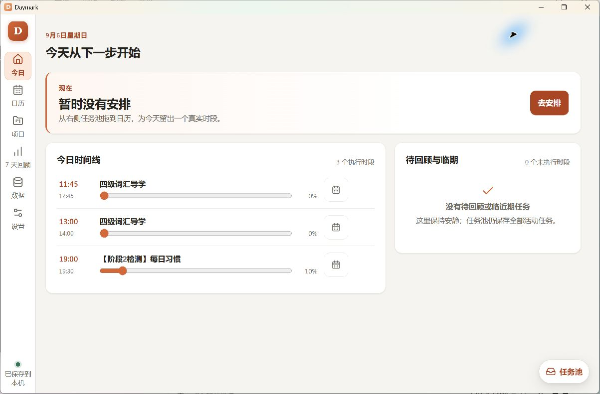

对照：[日历待回顾](gui-evaluation-2026-09-06/01-calendar-day.png)。

### G02 · P1 · 200% 设置仍三列，横向溢出

**复现**：设置→深色→缩放 200%；右侧字段超出窗口，出现水平滚动条，“7 天回顾”及保存状态拆成多行。

**原因线索**：字号随缩放变化，设置列最小宽度仍为固定 px；导航宽度也固定。不能仅用物理窗口宽度决定列数。

**修改**：按可用内容宽度与字体尺度重排。高缩放改一列；中间尺度两列；导航优先图标并配工具提示与可访问名称，保存状态用图标加短文案。表单行允许换行，字段容器 `min-width: 0`，时间组合在不足时纵向排列。

**验收**：960×640、1200×760 的内容窗口，在100%、150%、200%下核心控件可达；设置不产生页面级横向滚动。日历允许其专属网格按既定设计滚动，不等于全页溢出合格。

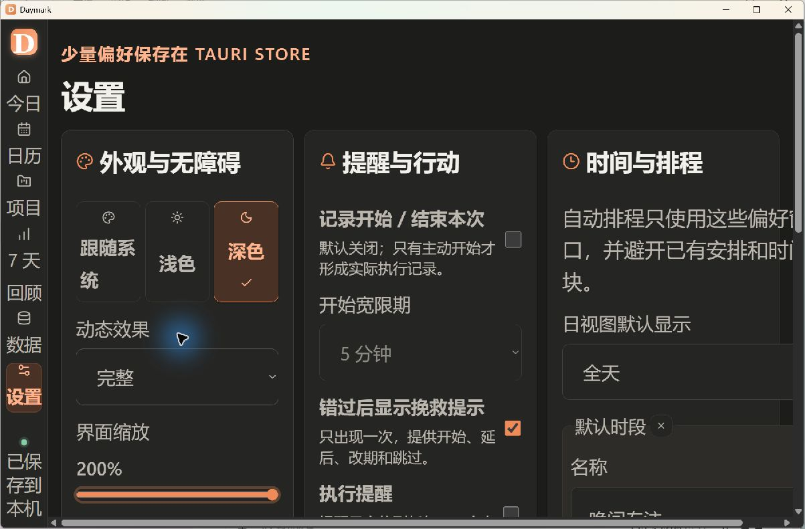

### G03 · P1 · 气泡展开后未避开容器底部

**复现**：日视图在可视区下半部单击空白，三入口气泡出现；点“新建任务”后表单增高，返回／创建区贴到视口底部并受滚动条遮挡。任务池编辑气泡也逼近底部。

**修改**：使用统一的浮层定位组件，基于真实渲染尺寸重新测量；在打开、子步骤变化、缩放、窗口变化时做翻转与平移。浮层通过 portal 脱离时间轴的 overflow 容器；内容滚动、底部按钮固定。不要靠预估高度一次定位。

**验收**：四角、滚动后、每种展开步骤和200%下，标题、关闭和提交按钮均完整可见；打开气泡不改变底层网格位置。

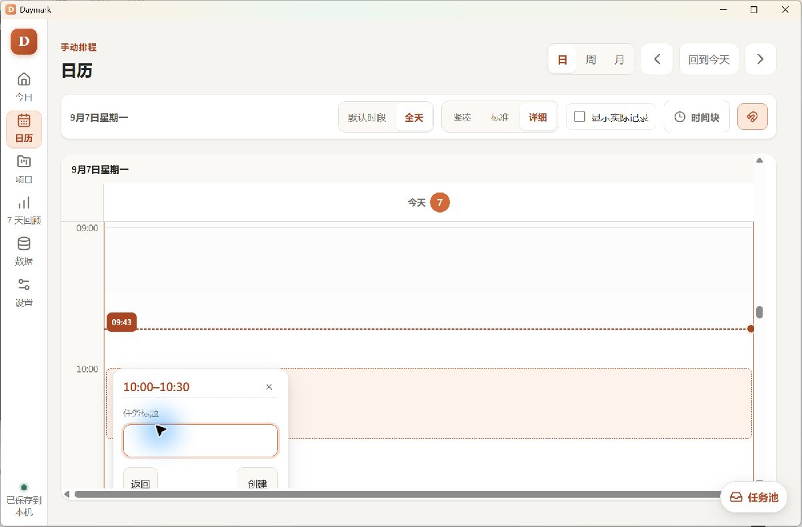

### G04 · P1 · 回顾与月历进度数字口径不同

**观察**：8/31 月历显示推进 +145%，七天回顾显示 +65%；9/4 月历显示 +35%，回顾显示 -25%。

**源码核对**：`calendarDaySummary` 只统计正向进度事件，`buildSevenDayReview` 统计全部增减。这些值描述不同事实，却都显示为“进度／推进 +N%”。回顾条宽还取 `max(progressDelta, actualMinutes / 3)`，混用了两种量纲。

**修改**：默认展示“推进任务数”和“实际投入分钟”；需要展示进度增量时，明确称“累计进度变化（百分点）”，统一净变化口径，或明确分成正向推进与修正。分钟图与进度图分开，负值用有零轴的表达或直接文字；不把跨任务总和写成总完成率。

**验收**：同一组 +100、-80、+45 事件，在所有摘要上按相同口径显示 +65 个百分点；历史曾完成与当前已完成分别命名，不静默修改历史。

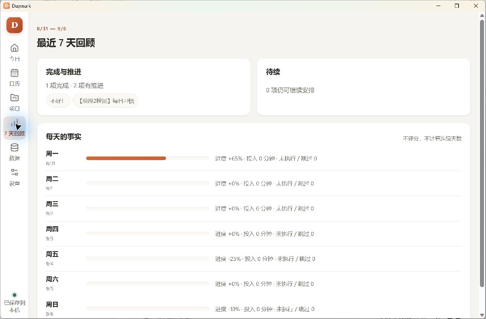

对照：[月历摘要](gui-evaluation-2026-09-06/18-month.png)。

### G05 · P2 · 切页把常驻任务池变成遮罩，阻断主行动

**复现**：默认窗口，日视图任务池展开→今日。右侧任务池保留但变为浮层，主区变暗，“去安排”和右栏被挡。

**源码核对**：1199px以下统一浮层规则与日视图专用常驻例外并存。这是现有响应式规则造成的行为，不是随机卡死。

**修改**：保存“用户是否主动打开浮层”和“宽屏侧栏偏好”为不同状态；导航切换默认关闭临时浮层。足够宽时可常驻；窄窗明确点击任务池才打开。避免从日视图进入今日时自动给用户增加关闭步骤。

**验收**：日历→今日→项目的主内容可立即操作，浮层不因前页侧栏展开而自动遮挡。

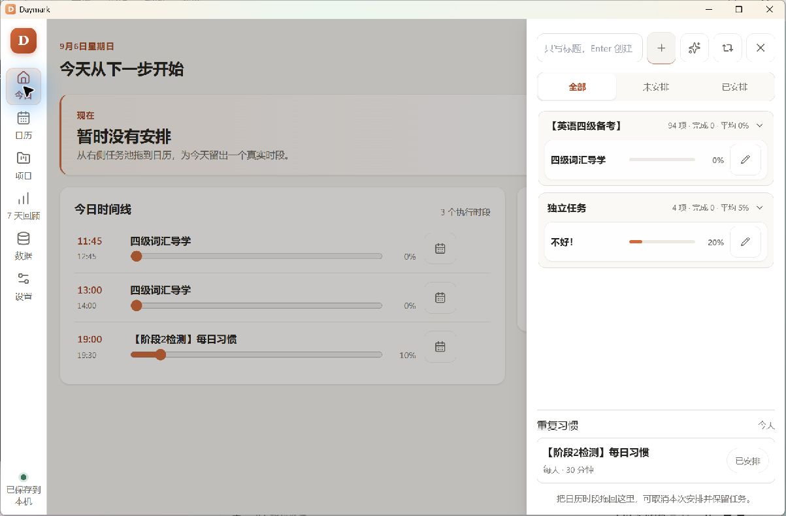

### G06 · P2 · 添加项目、里程碑与时间块占用页面流

**观察**：普通项目只含标题和可选截止，却展开整宽大卡片；新增里程碑位于项目卡内部，保存区落到首屏下方；工具栏时间块插入整行，把时间轴向下挤。

**修改**：新建项目、里程碑、时间块均改锚定气泡，具体规则见第5节。添加期间底层项目卡、滚动位置、日历当前时间不移动；关闭回到原“＋”。

**验收**：触发前后底层关键对象位置不变；里程碑普通条件在首层完成，任务条件仅展开一个搜索选择器；关闭草稿不会创建领域对象。

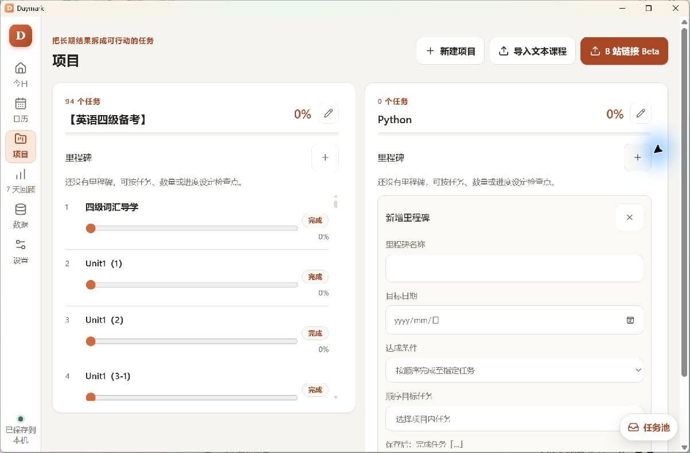

对照：[普通项目创建](gui-evaluation-2026-09-06/05-project-create.png)、[工具栏时间块](gui-evaluation-2026-09-06/25-time-block-inline.png)。

### G07 · P2 · 任务编辑保存方式隐蔽且不一致

**观察／源码**：气泡没有标题区、关闭按钮或保存说明；标题和时长在失焦保存，下拉项立即保存。用户难以知道点击外部是取消还是保存。

**修改**：完整任务编辑采用“草稿→保存／取消”；最常用单字段快速修改可以即改即存，但必须显示“已保存”并提供撤销。不要在同一个多字段表单混用两种提交方式。

**验收**：Esc不提交草稿；保存后只提交一次有效变更；失败信息留在气泡内，输入不丢；关闭后焦点返回编辑按钮。现有 Esc 焦点恢复行为应保留。

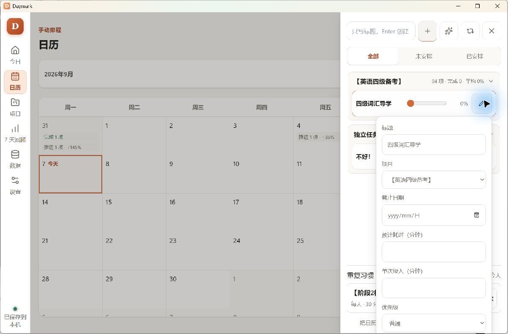

### G08 · P2 · 长课程缺乏定位工具，卡片密度不匹配规模

**观察**：项目页94个任务，首屏仅约4项；每项永久展示大滑块与完成按钮。任务池分组收起时显示1项却报告94项，没有“当前仅显示下一项”的解释，展开后又形成长滚动列表。

**修改**：项目总览保留摘要，任务进入项目详情列表；支持项目内搜索、未完成筛选、跳到最近推进位置。任务行默认标题／进度文本／安排入口，进度编辑按需展开；任务池收起状态明确“下一项 · 查看全部94项”。

**验收**：用户能搜索并定位第70节，不必逐屏滚动；打开详情、改进度后保留原列表位置；已有任务ID不变。

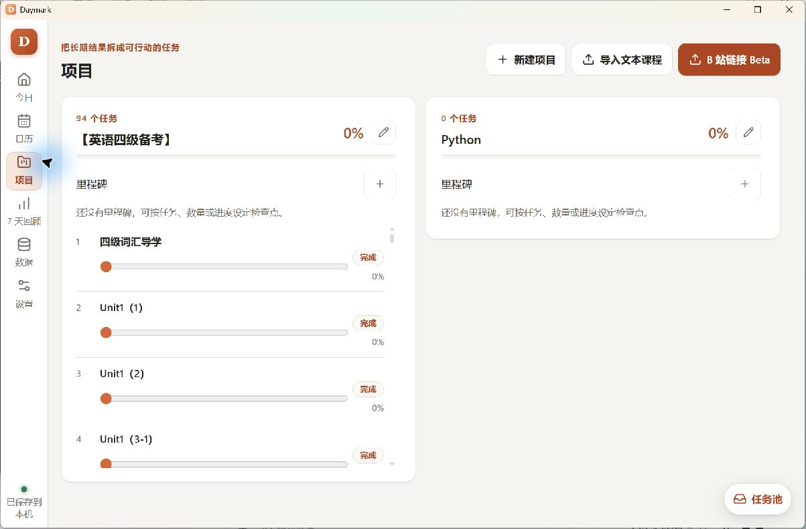

对照：[任务池展开](gui-evaluation-2026-09-06/24-task-pool-expanded.png)。

### G09 · P2 · 历史安排被标为“下次”

**证据**：任务池可访问性文本中，9/6、9/7仍把8/31 19:30列为“下次”。`TaskPoolCard`只按 scheduled 状态取第一项，不排除已过去时段。

**修改**：分开“下一次安排”“待回顾安排”和“历史安排”。未安排筛选建议按“没有未来有效安排”定义，并通过说明明确含义；这是筛选语义调整，实施时需要与领域文档一起核对。

**验收**：只有过去安排的未完成任务不再宣称存在未来安排；无未来安排时提供继续安排入口。

证据：[首次日历可访问性记录](gui-evaluation-2026-09-06/01-calendar-day.txt)。

### G10 · P2 · 日／周／月切换保留了不适用的滚动位置

**观察**：周视图从午夜开始；“回到现在”可正常滚到19点附近。随后切月，星期栏不在视野内，打开日期详情时顶部按钮被截。次日重启月历时星期栏恢复，说明它不是永久缺失。

**修改**：每视图独立管理滚动锚点；第一次打开当前周定位当前时间或主要时段；月历进入时日期头必须可见，日期详情独立滚动。滚动恢复优先保留语义日期／时间，不复用不同视图的像素scrollTop。

**验收**：日→周（回到现在）→月→选日连续操作，日期头与详情主动作完整；回到原视图保留合理位置。

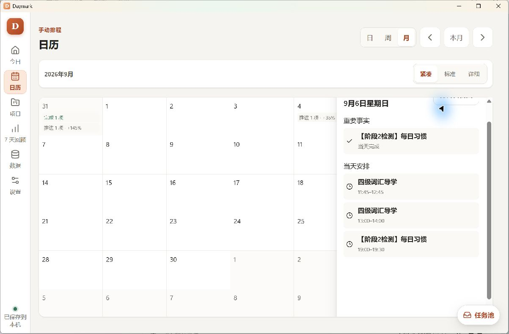

### G11 · P2 · 导入模式共享了不同含义的输入

**复现**：文本课程输入两行→点B站链接，原课程文本出现在链接框。点击读取出现BV号错误。

**修改**：文本草稿和URL草稿分离；切换模式保留各自内容，不串用。URL非法时按钮禁用或在字段下给出就近说明。新建／导入按钮状态应说明还缺项目标题或未选择分集。

**验收**：两种模式来回切换各自内容保持正确；取消清理当前草稿的规则统一；无效URL不发起网络请求。

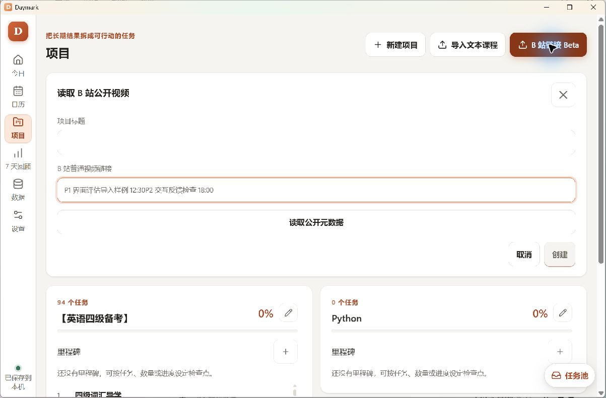

### G12 · P2 · 自动排程缺少清晰的选择和日期概览

**观察**：默认选中26项、使用1199/1199分钟；确认页先列9/7—9/12习惯，再出现9/6普通任务；只有返回选择／应用全部，缺少常显关闭入口。

**修改**：候选提供搜索、全选／清空、按项目选择和容量反馈；草案按日期、开始时间排序并分日；标明任务与习惯数量及每日占用。“1199分钟”改为“19小时59分钟”，同时保留精确值入口。确认页可返回、取消，主要按钮写“应用26个时段”。

**验收**：无需滚到列表底部就能理解7天安排规模；相同输入产生相同草案；预览和取消不写日历事实；应用成功可整批撤销。

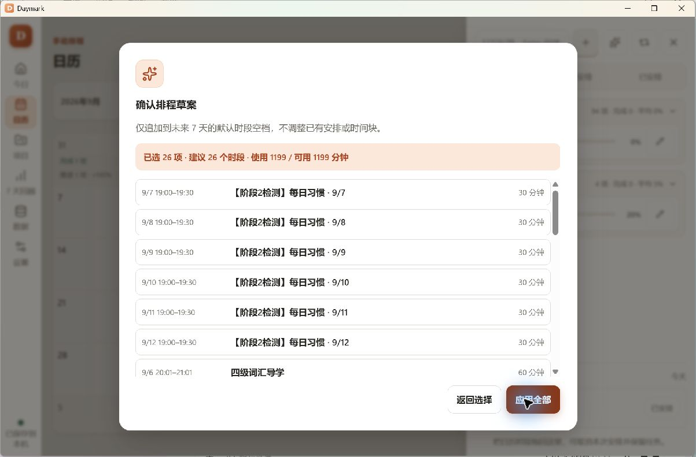

### G13 · P2 · 数据页优先级与备份可读性不合适

**观察**：主强调按钮是“恢复”；列表重复“每日备份”和长路径，日期埋在文件名；恢复选择器默认打开文档目录；预览只有项目／任务数量及路径。

**修改**：主要动作改“立即备份”，恢复放次级危险区；列表按时间显示日期、备份类型、大小、最近验证结果，路径折叠；每行直接“预览恢复”。预览说明当前与目标数量、备份时间、是否包含设置、即将覆盖范围及恢复前备份位置。底层恢复协议维持不变。

**验收**：不用阅读路径就能找到昨天的备份；恢复前用户能说清覆盖对象；取消不替换数据；自动备份失败持续可见。

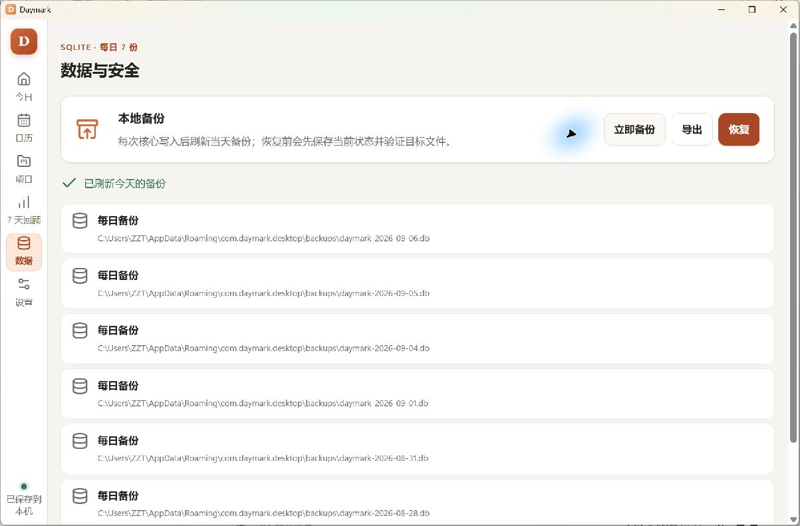

对照：[恢复确认](gui-evaluation-2026-09-06/12-restore-preview.png)。

### G14 · P2 · 空项目里程碑缺少前置条件引导

**观察**：0任务项目点添加里程碑，默认“按顺序完成至指定任务”，但目标列表无任务；界面没有明确的下一步指引。

**修改**：没有任务时提示先添加任务，禁用无法成立的任务条件；不要默认选一个不可完成的表单。每种条件显示一条动态自然语言预览。空项目的数量／进度条件是否可配置需依照现有模型校验统一处理，不为绕过限制制造虚假任务。

**验收**：空项目不能进入无解释的禁用保存状态；合法条件只有一个；错误就近说明如何解决。

### G15 · P2 · 设置分组长短悬殊，辅助选项状态不够明确

**观察**：三列等高导致左列大量空白，右列很长；开始记录关闭时“开始宽限期”禁用，但挽救提示仍可勾选；未开启执行提醒时提前量仍显示可编辑。

**修改**：设置改成按主题分节的紧凑行或单列分组；依赖项解释“开启记录后生效”“开启提醒后生效”，保存偏好与当前生效状态分别表达。默认时段显示摘要行，点击或添加时弹气泡编辑，不长期展开所有字段。

**验收**：用户能区分“已配置但未生效”与“正在生效”；三个分组在高缩放下自然重排；关闭功能不删除历史记录或已有偏好。

### G16 · P3 · 主次动作和技术文案需要统一

**观察**：项目页B站导入是最强按钮，普通新建较弱；设置顶部直接写Tauri Store；数据页写SQLite；任务池新建、自动排程、习惯主要靠图标识别。窄窗隐藏所有summary-pills，今日和回顾的核心摘要也消失。

**修改**：每页只保留一项主行动：项目“新建项目”，数据“立即备份”，今日“开始／继续／去安排”。导入归为次级菜单。技术实现移至“关于／诊断”；顶部改“外观、提醒和排程偏好”“备份与恢复”。摘要不足时换行或简化，不整组隐藏。图标有tooltip、可访问名称和足够点击区。

### G17 · P3 · 视觉层级需要从卡片装饰转向内容

**修改建议**：保留暖杏主色；页面底色、内容表面、浮层三层足够。列表行减少重复圆角外框，用轻分隔线；主标题、条目标题、辅助说明维持三档。橙色用于当前动作／选中状态，待回顾使用文字和小图标，减少整周相同橙框。优先保证标题阅读，不以常显大滑块占据行宽。

**验收**：浅／深色分别检查文字、控件、边界、焦点；对比度需测量后判定。大按钮约40–44px；密集列表的小图标可以视觉较小，但扩展点击目标；气泡关闭按钮不要只有24px命中区。

## 5. 统一气泡交互方案

### 5.1 使用边界

| 操作 | 推荐容器 | 首层内容 |
| --- | --- | --- |
| 新建普通项目 | 锚定“新建项目”的气泡 | 标题、可选截止、创建／取消 |
| 新增／编辑里程碑 | 锚定项目内“＋”或里程碑行 | 名称、日期、一个达成条件、动态条件字段、保存／取消 |
| 添加任务 | 锚定“＋”或日历时间范围 | 标题、预填项目／时段、“更多选项”、创建／取消 |
| 编辑单个日期／优先级 | 小气泡 | 单字段选择，保存反馈；已提交可撤销 |
| 编辑任务多个字段 | 气泡，复杂信息可转详情侧栏 | 草稿字段、保存／取消、错误区 |
| 新建重复习惯 | 气泡 | 名称、规则、时长；固定开始按需展开 |
| 创建／编辑时间块 | 锚定工具栏或时间范围气泡 | 标题、日期、开始／结束 |
| 添加／编辑默认时段 | 锚定摘要行气泡 | 名称、起止、星期、保存／取消 |
| 文本／B站批量导入 | 侧栏或较大对话框 | 来源→解析→分集预览；固定底部操作 |
| 自动排程 | 较大对话框或专属侧栏 | 候选选择、容量、按日草案 |
| 结束本次 | 紧凑对话框 | 投入、进度、小结；明确“结束执行”与“完成任务”区别 |
| 恢复数据 | 模态确认 | 覆盖范围、恢复前备份、明确的危险主动作 |

气泡适用于保持上下文的局部操作；批量列表或高影响确认保留足够空间。已有习惯气泡是正面示例，但不能直接复制固定宽度和预估高度逻辑。

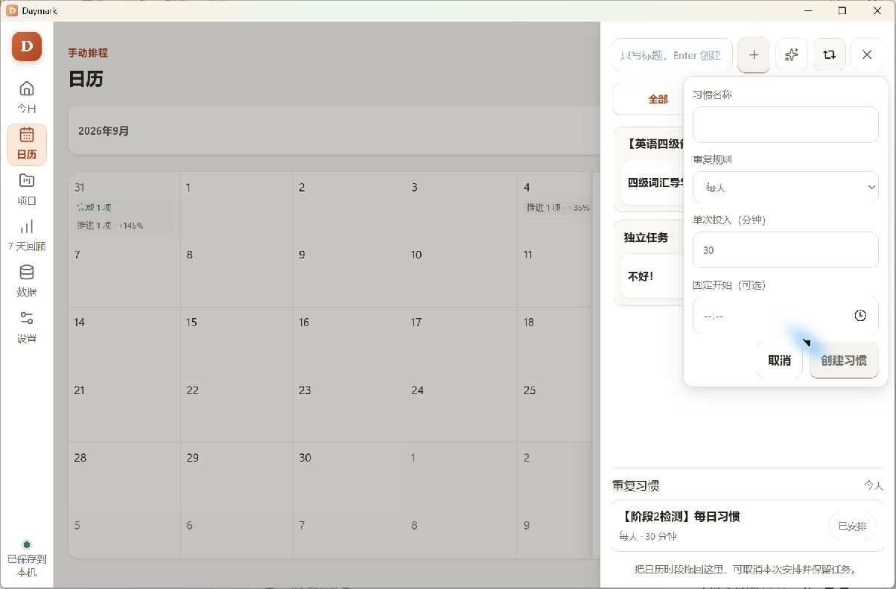

### 5.2 里程碑气泡内容示意

```text
项目摘要                              [＋]
                              ┌─────────────────────────┐
                              │ 添加里程碑           ×  │
                              │ 名称                     │
                              │ [完成基础章节          ] │
                              │ 目标日期 [9月20日      ] │
                              │ 达成条件 [完成任务数量 ▾] │
                              │ 完成 [ 10 ] 项任务        │
                              │ 9月20日前完成10项任务     │
                              │                         │
                              │       [取消] [添加里程碑] │
                              └─────────────────────────┘
```

选择“指定任务”后在同一个气泡内展示带搜索的任务选择，不叠一张大卡片；选择“项目进度”后只显示百分比。切换条件保留当前草稿中各条件的临时输入，但最终提交只有所选的一种。

### 5.3 尺寸与定位

- 起始宽度建议：单字段240–300px，任务／里程碑320–380px；这是设计起点，最终以内容与缩放验证为准。
- 与触发点间距8px；窗口安全边距至少12px。优先下方，空间不足转上方，随后左右平移。
- 最大高度为可用视口减安全边距；顶部标题与底部动作保持可见，只有内容区滚动。
- 日期选择器等子浮层打开时，点击它不应被父气泡当作外部点击。
- 页面内只开一个主编辑气泡。点击另一触发点时先处理旧草稿，不静默丢失。
- 滚动可见锚点时同步跟随；锚点离开视口或消失时安全关闭并保留草稿，不能悬在无关对象旁。
- 200%或小窗口无法容纳时，退化为贴边面板／紧凑对话框，保留同一草稿；不通过缩小文字规避问题。

### 5.4 关闭、保存和键盘

1. 打开后焦点进入首个有效字段，并具有明确的dialog名称。
2. 多字段创建与编辑是草稿：保存成功才改变核心数据。按钮显示忙碌状态，阻止重复提交。
3. 无修改：Esc、关闭、取消均直接退出，焦点回触发点。
4. 有修改：外部点击优先保留会话草稿；明确取消可提示“放弃修改”。不把关闭当作保存。
5. 即改即存只用于独立快捷字段，并显示“已保存／保存失败”与撤销入口；Esc不是回滚已经提交的数据。
6. 校验在字段附近显示，保留输入；无障碍错误关联字段并礼貌播报。
7. Enter仅在适合的单行输入中提交；多行内容保留换行。Tab按视觉顺序移动，普通非模态气泡不制造键盘陷阱；危险模态限制焦点。
8. 减少动态时保留即时定位与状态反馈；不依赖动画表达成功。

## 6. 建议实施顺序与代码入口

| 批次 | 工作包 | 问题 | 实现入口 | 完成标准 |
| --- | --- | --- | --- | --- |
| A | 状态与摘要口径 | G01、G04、G09 | `TodayPage`、`TaskPoolCard`、`review.ts`、`calendarSummary.ts` | 同一事实跨页一致；补正向／负向／历史安排边界测试 |
| B | 浮层基础与适配 | G02、G03、G05、G10 | 应用壳、`styles.css`、各popover位置逻辑、日历滚动容器 | 四角／高缩放可操作；跨页无意外遮罩；切视图位置正确 |
| C | 轻量创建改造 | G06、G07、G14、G15 | `ProjectsPage`、里程碑表单、`TaskEditorFields`、`SettingsPage` | 项目、里程碑、任务、时间块、默认时段使用统一容器与保存规则 |
| D | 大量数据与预览 | G08、G11、G12、G13 | 项目列表、课程导入、`AutoScheduleDialog`、`DataPage` | 长列表可定位；导入草稿分离；排程按日；备份可读 |
| E | 视觉收尾 | G16、G17 | CSS语义变量、按钮组件、页头、列表行 | 主次动作一致；浅／深色与文字可读性验证 |

优先处理 A、B，再做 C，避免把越界和错误状态复制到新的气泡。一次不要同时修改领域事实、全部页面布局和存储协议。现有计划／执行／进度分离、事务、备份回滚机制应保留。

以上是本地工作包建议，尚未创建GitHub Issues。若进入开发，应按仓库的Issue工作流和 `docs/PROJECT-GUIDE.md` 实现；状态／筛选语义变化再同步领域文档，不能把本方案自动当作已发布实现。

## 7. 修改后的验收计划

### GUI 必测场景

| 场景 | 验收重点 |
| --- | --- |
| 初次空库→创建项目→添加任务→里程碑 | 空态有可行动入口；局部操作不挤页面；正确预填项目 |
| 100项以上课程→搜索→编辑→返回 | 定位、滚动、焦点不丢；不显示虚假“下一次” |
| 今日／日历待回顾→更新／继续／未推进 | 显示与数据语义一致，选择由用户确认 |
| 日／周拖入→移动→调时长→插入后移→撤销 | 时间预览准确；所有受影响时段可一组撤销；不复制任务 |
| 并行2／3／4项和短时段 | 标题可识别，所有项目均有操作入口 |
| 日视图折叠区／跨日／缩放→打开气泡 | 锚点稳定，底部不遮挡，打开不创建事实 |
| 三种里程碑条件与空项目 | 仅一种条件生效；非法输入有解释；到期快照语义不变 |
| 文本与B站切换；有效／无效／网络失败 | 草稿隔离、加载反馈、取消与重试；未确认不导入 |
| 自动排程0项／多项目／容量不足／习惯 | 默认选择可理解，按日预览，应用与撤销原子化 |
| 开始→结束→修正投入与进度→七天回顾 | 结束不自动完成任务；净变化与历史事实口径一致 |
| 备份→导出→恢复预览→取消／确认；损坏备份 | 明确覆盖范围，失败反馈与回滚，无虚假成功 |
| 托盘隐藏／恢复、通知路由 | 只定位正确目标，不自动签到；应单独实机验证 |
| 960×640、1200×760、宽窗；100／150／200% | 主动作完整、内容重排、气泡边界、导航可识别 |
| 浅色、深色、跟随系统、减少动态、键盘 | 对比度实测、Tab／Esc／Enter、焦点恢复和错误播报 |

### 自动化与实机分工

- 纯状态测试：待回顾判定、跨日、未来安排筛选、净进度与修正事件。
- 组件测试：气泡草稿、取消、提交失败、父子浮层、焦点返回、重复提交拦截。
- 浏览器E2E：复用 `e2e/phase1.spec.ts` 的核心流程，补气泡四角和200%设置页。现有“200%数据页按钮可见”不等于设置页适配已覆盖。
- 原生测试：存储、备份、恢复的正确性单独验证；浏览器预览通过不能代替SQLite／Tauri结果。
- 人工实机：拖拽手感、信息密度、滚动定位、主题观感、托盘／通知必须实际观察。

## 8. 证据索引

全部证据位于 [gui-evaluation-2026-09-06](gui-evaluation-2026-09-06/)，PNG为界面截图，同名TXT为可访问性观察。截图以当时数据为准，次日相对时间与发生项状态变化属于正常时间变化，不直接视作回归。

| 编号 | 内容 | 编号 | 内容 |
| --- | --- | --- | --- |
| 01 | 日历日视图与待回顾 | 15 | 设置200% |
| 02 | 今日页任务池遮罩 | 16 | 周视图午夜起点 |
| 03 | 今日主内容 | 17 | 周视图回到现在 |
| 04 | 项目总览与长课程 | 18 | 月历 |
| 05 | 普通项目创建 | 19 | 月历日期详情 |
| 06 | 文本课程预览 | 20 | 自动排程选择 |
| 07 | 导入模式内容串用 | 21 | 自动排程草案 |
| 08 | 无效B站链接错误 | 22 | 习惯气泡 |
| 09 | 空项目里程碑表单 | 23 | 任务编辑气泡 |
| 10 | 七天回顾 | 24 | 任务池展开 |
| 11 | 备份成功与列表 | 25 | 工具栏时间块表单 |
| 12 | 恢复预览 | 26 | 日历空白添加气泡 |
| 13 | 设置浅色 | 27 | 气泡展开后底部遮挡 |
| 14 | 设置深色 | — | — |

## 9. 本次交付与尚未验证内容

已交付：六页GUI观察、主要子流程检查、27组证据、17项问题、统一气泡设计规则、分批修改方案及后续验收清单。

未交付：产品代码修改、完整写入／异常回归、通知实机验证、所有状态的无障碍合规结论。开始／结束运行态仅审阅源码，其余未测试路径详见第3节。文档中的拟议验收标准是下一阶段的完成条件，不是本次已通过结果。


后续实现与本轮验证：见 [2026-09-08 GUI 优化实施记录](gui-optimization-2026-09-08.md)。本文保留原始评估事实，未将拟议验收项追溯标记为当时已通过。
