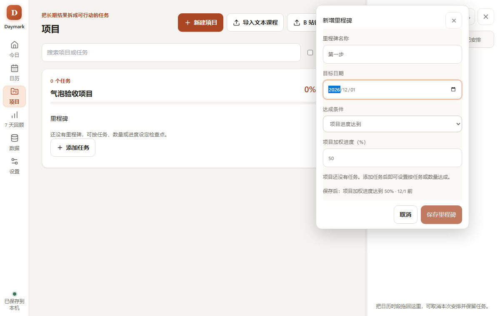
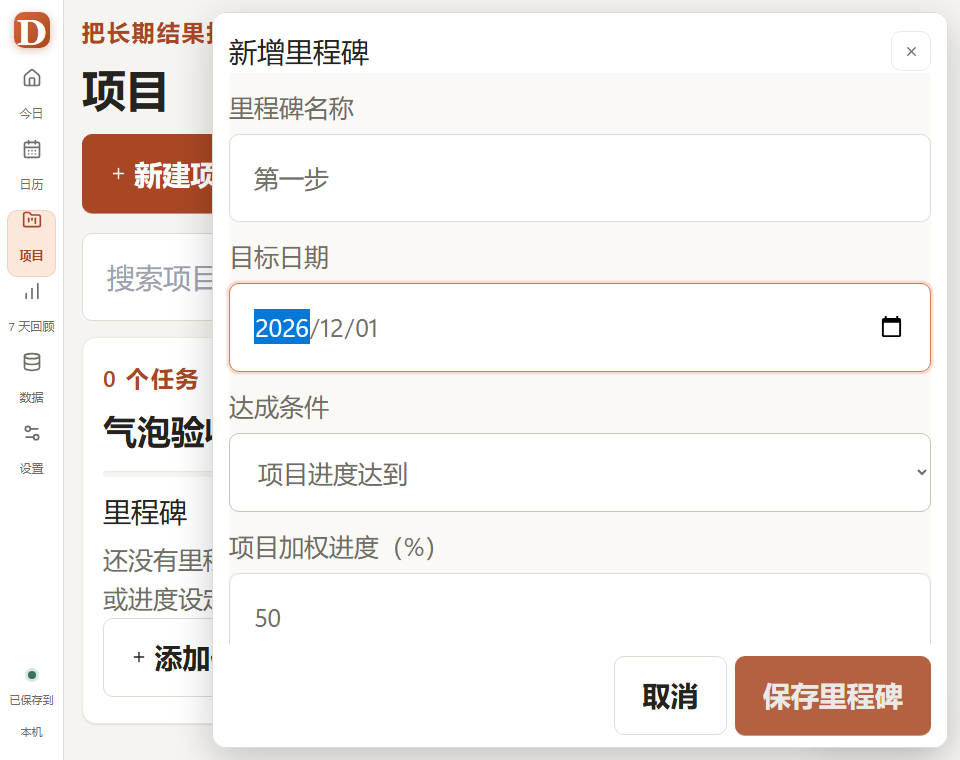

# GUI 优化实施记录

日期：2026-09-08。依据：[GUI 评估与修改方案](gui-evaluation-2026-09-06.md)。

## 已落实的修改

| 原问题 | 本轮实现 |
| --- | --- |
| G01 今日待回顾 | 今日与日历共用待回顾判断；包含跨午夜安排；显示更新进度、继续安排和明确记录未推进的入口，时间经过不写入未推进事实。 |
| G02 高缩放 | 设置按缩放后的可用宽度重排，时间字段可换行，窄窗保留摘要；高缩放导航保持可识别。 |
| G03 气泡越界 | 新增共享 FloatingPanel，Portal 呈现、实测翻转和避让、12px安全边距、内部滚动与操作区固定；拦截背景指针操作，避免叠开互相阻塞的浮层。 |
| G04 统计 | 月历和回顾均计算包含下调的净变化，单位改为百分点；当日曾完成与当前进度区分；回顾图条只表达投入，不再混合分钟与进度。 |
| G05 任务池遮挡 | 临时覆盖面板与侧栏开关独立；窄窗需主动打开浮层，切页会收起，不继承日视图侧栏状态。 |
| G06 大表单 | 项目、项目任务、里程碑、工具栏时间块、默认时段均用气泡；里程碑编辑保留原行，时间块草稿日期不改变背景日历日期。 |
| G07 保存不一致 | 任务多字段编辑改为草稿＋保存／取消，Esc不提交且恢复焦点；保存失败保留字段并在气泡提示。 |
| G08 长课程 | 搜索项目或任务、只看未完成、最近推进定位、原序号、进度按需展开、任务内安排入口；项目内可直接添加任务，任务池收起时解释“下一项／全部数量”。 |
| G09 历史当下次 | 下一次安排与已安排筛选只计算尚未开始的有效时段；过去安排不冒充下一次。 |
| G10 日历滚动 | 月历进入时复位到顶部，不再继承周时间轴偏移；保留既有首次进入当前时间与“回到现在”入口。 |
| G11 导入草稿 | 文本、B站链接与各模式项目标题隔离；取消保留对应草稿；无效链接先本地解析，失败保留输入。 |
| G12 排程预览 | 搜索、项目过滤、批量选择／清空；按日期分组并按时间排序，显示每日时段数量和投入；应用按钮显示数量，预览可直接取消。 |
| G13 备份 | 每条备份只读检查并显示日期、大小、结果与折叠路径；恢复前展示当前／目标数量、覆盖范围和设置包含情况，原有恢复前备份与回滚保持不变。 |
| G14 空里程碑 | 空项目默认使用进度条件，禁用按任务／数量的条件并解释如何启用；始终只保存一个达成条件。 |
| G15 设置密度 | 默认时段变为摘要行，添加／编辑确认后保存；关闭提醒时禁用提前量，签到相关依赖有说明。 |
| G16 操作层级 | 新建项目、立即备份成为主动作；恢复为次级入口，危险确认仍独立；移除设置与数据页的技术实现术语。 |
| G17 视觉统一 | 保留暖杏主题，共享浮层层级与边距，项目任务改用分隔行，减少常驻进度控件，缩放时摘要换行。 |

## 使用方式

- 添加里程碑或内容：点击所在项目的加号／“添加任务”，在气泡中填写并保存，背景列表保持原位。
- 草稿的外部点击不会保存或丢弃，也不会触发背景操作。请用保存、取消或Esc结束编辑；保存进行中不能取消。
- 高缩放时气泡使用窗口内滚动，底部操作区保持可达；复杂课程导入使用更宽面板。
- 项目任务的“安排”打开预选该任务的排程草案，仍需确认后才写入。

## 验证与产物

`npm run check` 最终通过：生产构建通过，Vitest **125/125**、Playwright **24/24**、Rust **37/37**。完整检查记录保存在同目录证据文件中。

关键界面证据：

桌面启动冒烟：已打开本轮 release，确认原有任务池和日历正常加载，未手动修改真实任务或安排。

桌面产物：`src-tauri/target/release/daymark.exe` 与 `src-tauri/target/release/bundle/nsis/Daymark_0.1.0_x64-setup.exe`。最终打包结果与校验值见同目录产物记录。

本轮增加：净进度下调回归、习惯慢请求防重复及失败保留草稿、六组尺寸／缩放气泡验证、取消不保存与焦点恢复、背景无法叠开第二个气泡、导入隔离与项目任务新增，以及备份设置包含情况的原生测试。

## 边界

- 未改 SQLite schema、排程事务、进度权威值或恢复替换协议。备份预览只增加只读说明字段。
- 本轮没有使用真实个人数据库执行恢复覆盖，也没有重做Windows通知、托盘点击路由和21天真实使用验证；这些不能由浏览器结果替代。
- 未新增日／周独立滚动位置持久化；该扩展在验证中影响了既有缩放与拖拽，因此本轮保留原有行为。日期锚点与缩放偏好继续持久化。
- 保留原有 `src-tauri/Cargo.toml` 未提交改动，不把它纳入本轮提交。
